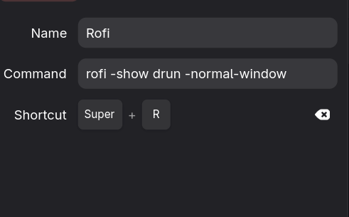

# What and why?
I tried to use Rofi drun with my Fedora linux and ran into a problem. I made a shortcut key that run `rofi -show drun` -> after pressing the key rofi starts, but I just could not write anything, it didn't focus the window.

# How to fix it?

1. Go to Settings app -> Keyboard -> Keyboard shortcuts -> Custom shortcuts
2. Make new shortcut, call it whatever you like and write `rofi -show drun -normal-window`
3. Insert shortcut that you want to use

After those steps rofi should focus to the window.

**References:**